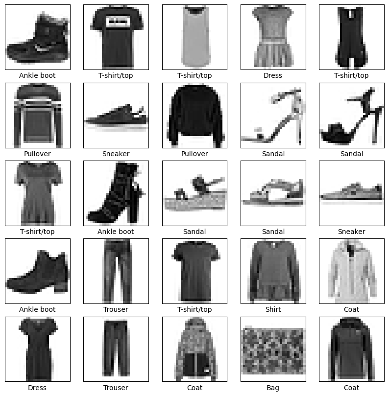
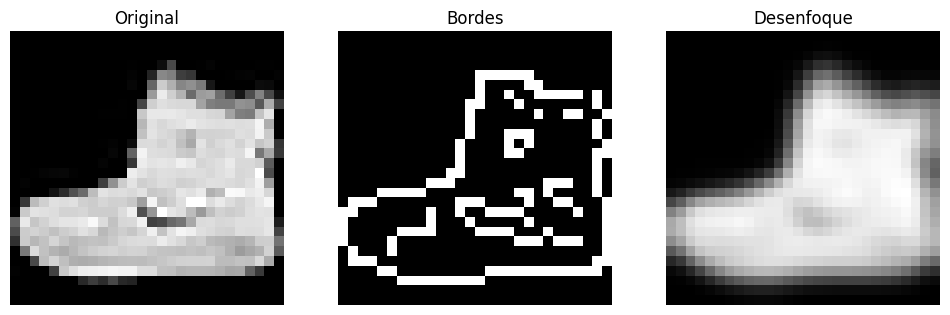
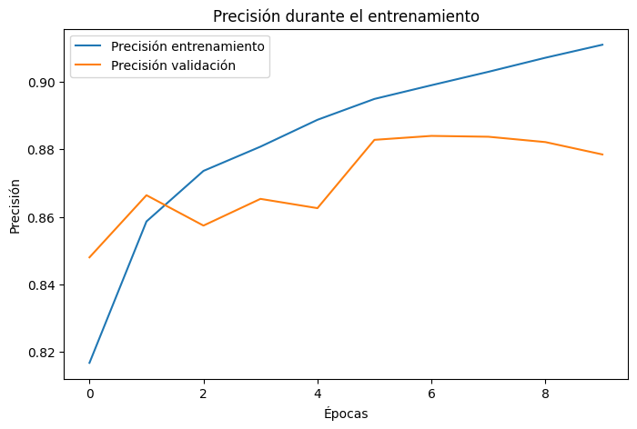
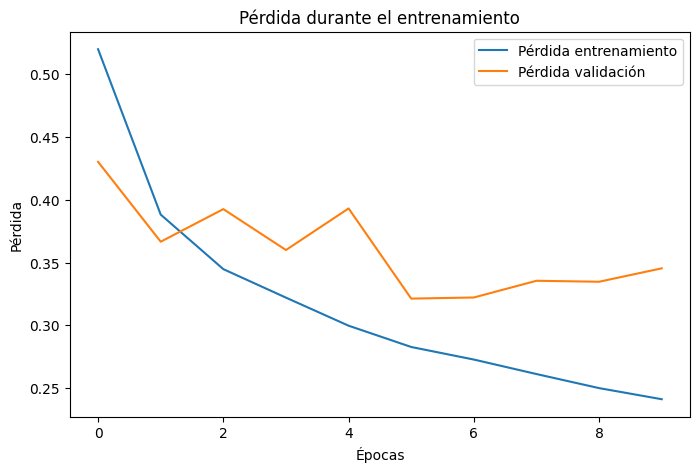
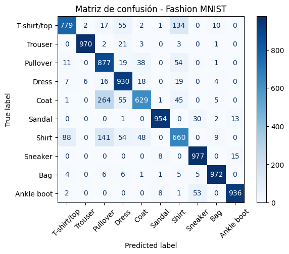

# Fashion MNIST - Clasificación de prendas con Red Neuronal

Proyecto de clasificación de imágenes utilizando el dataset **Fashion MNIST** y una red neuronal desarrollada con **TensorFlow/Keras**.

El objetivo del proyecto es entrenar un modelo capaz de reconocer diferentes tipos de prendas de ropa a partir de imágenes de 28x28 píxeles. Además del entrenamiento del modelo, se aplican técnicas básicas de procesamiento de imágenes con OpenCV y se realizan pruebas con imágenes propias.

## Dataset

Se utiliza **Fashion MNIST**, un conjunto de datos incluido en Keras que contiene imágenes en escala de grises de prendas de ropa.

El dataset contiene 10 clases:

- T-shirt/top
- Trouser
- Pullover
- Dress
- Coat
- Sandal
- Shirt
- Sneaker
- Bag
- Ankle boot

El conjunto se divide en imágenes de entrenamiento y prueba.

```python
fashion_mnist = keras.datasets.fashion_mnist

(train_images, train_labels), (test_images, test_labels) = fashion_mnist.load_data()
```

Por esta razón no es necesario almacenar un archivo CSV dentro del repositorio.

## Tecnologías utilizadas

- Python
- TensorFlow
- Keras
- NumPy
- Matplotlib
- OpenCV
- Scikit-learn
- Google Colab

## Procesamiento de imágenes

Antes del entrenamiento, los valores de los píxeles se normalizan de un rango de 0-255 a valores entre 0 y 1.

```python
train_images = train_images / 255.0
test_images = test_images / 255.0
```

También se utilizan técnicas de procesamiento de imágenes para visualizar características de las prendas.

Entre los procesos utilizados se encuentran:

- Conversión a escala de grises
- Detección de bordes con Canny
- Desenfoque Gaussiano
- Umbralización automática con Otsu
- Operaciones morfológicas
- Detección de contornos
- Recorte del objeto principal
- Redimensionamiento a 28x28 píxeles

## Modelo de Red Neuronal

Se desarrolló una red neuronal utilizando Keras.

La arquitectura utilizada es:

```python
model = keras.Sequential([
    keras.layers.Flatten(input_shape=(28,28)),
    keras.layers.Dense(128, activation='relu'),
    keras.layers.Dense(10, activation='softmax')
])
```

La primera capa transforma la imagen de 28x28 píxeles en un vector.

Después se utiliza una capa Dense con 128 neuronas y función de activación ReLU.

Finalmente, la capa de salida contiene 10 neuronas con Softmax, una por cada categoría de Fashion MNIST.

## Entrenamiento

El modelo se compila utilizando:

- Optimizador: Adam
- Función de pérdida: Sparse Categorical Crossentropy
- Métrica: Accuracy

El entrenamiento se realiza durante 10 épocas y se utiliza el 20% del conjunto de entrenamiento como datos de validación.

```python
history = model.fit(
    train_images,
    train_labels,
    epochs=10,
    validation_split=0.2
)
```

## Evaluación del modelo

Después del entrenamiento, el modelo se evalúa utilizando las imágenes del conjunto de prueba.

Se analizan principalmente:

- Accuracy
- Loss
- Accuracy de entrenamiento
- Accuracy de validación
- Loss de entrenamiento
- Loss de validación

Estas gráficas permiten observar cómo cambia el desempeño del modelo conforme avanzan las épocas.

## Predicciones

El modelo también realiza predicciones sobre imágenes que no fueron utilizadas directamente durante el entrenamiento.

```python
predictions = model.predict(test_images)
```

Para cada imagen, el modelo genera la probabilidad de pertenecer a cada una de las 10 categorías.

La clase con mayor probabilidad se utiliza como predicción final.

## Prueba con imágenes propias

Una parte adicional del proyecto permite subir una imagen desde la computadora y utilizarla para realizar una predicción.

Debido a que una fotografía normal tiene características diferentes a una imagen de Fashion MNIST, se realiza un proceso adicional para intentar hacerla más similar al dataset.

El proceso incluye:

1. Convertir la imagen a escala de grises.
2. Reducir ruido mediante desenfoque Gaussiano.
3. Separar el objeto del fondo.
4. Detectar si el fondo es claro u oscuro.
5. Detectar el contorno principal.
6. Recortar la prenda.
7. Centrarla sobre un fondo negro.
8. Redimensionarla a 28x28 píxeles.
9. Normalizar los valores.
10. Enviar la imagen procesada al modelo.

Además de mostrar la predicción principal, se presentan las **3 clases con mayor probabilidad**, lo cual permite observar si el modelo tiene dudas entre prendas visualmente similares.

## Matriz de confusión

Finalmente se genera una matriz de confusión utilizando las predicciones realizadas sobre el conjunto de prueba.

Esta matriz permite identificar en qué categorías el modelo obtiene mejores resultados y cuáles tiende a confundir.

## Resultados visuales

### Ejemplos del dataset



### Procesamiento con filtros



### Precisión durante el entrenamiento



### Pérdida durante el entrenamiento



### Prueba con imagen propia


### Matriz de confusión



## Estructura del repositorio

```text
fashion-mnist-classification/
│
├── Fashion_MNIST_Clasificacion.ipynb
├── README.md
│
└── images/
    ├── dataset_ejemplos.png
    ├── filtros.png
    ├── precision_entrenamiento.png
    ├── perdida_entrenamiento.png
    ├── imagen_propia.png
    └── matriz_confusion.png
```

## Objetivo del proyecto

Este proyecto fue desarrollado como práctica de inteligencia artificial y procesamiento de imágenes, con el objetivo de comprender el proceso completo de construcción de un modelo de clasificación: desde la preparación de los datos y entrenamiento de una red neuronal hasta la evaluación y prueba con imágenes externas.

También permitió observar una de las principales dificultades de los modelos de visión artificial: una imagen tomada en condiciones reales puede ser muy diferente a las imágenes utilizadas durante el entrenamiento, por lo que el preprocesamiento juega un papel importante en el resultado de la clasificación.
